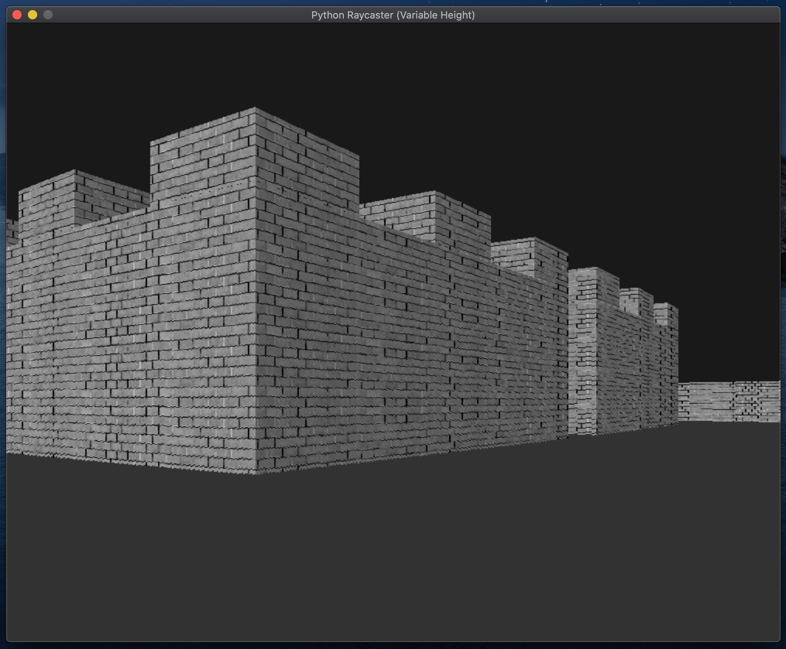
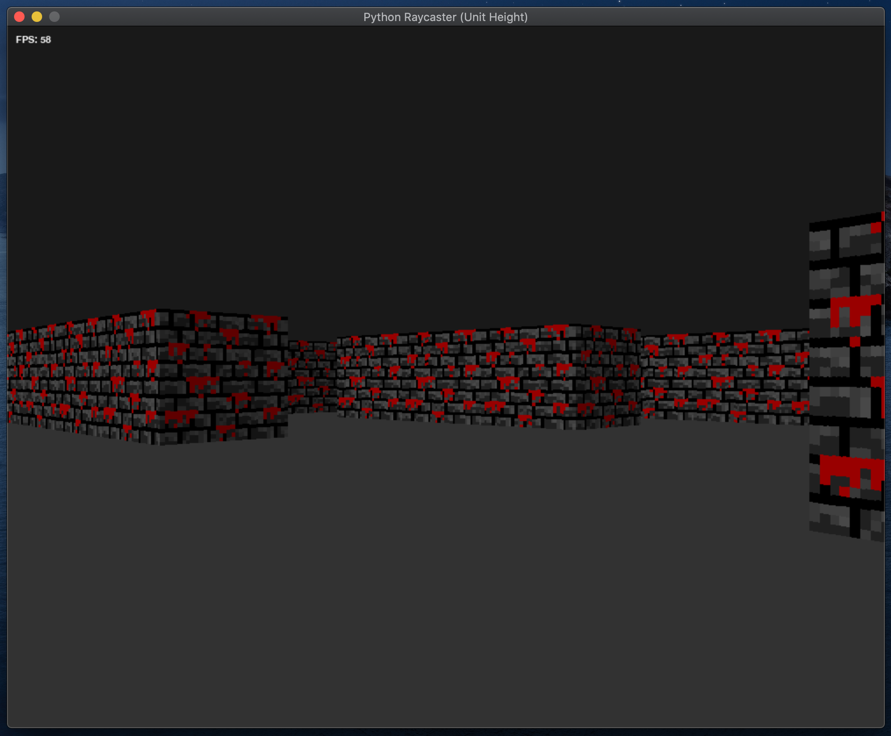
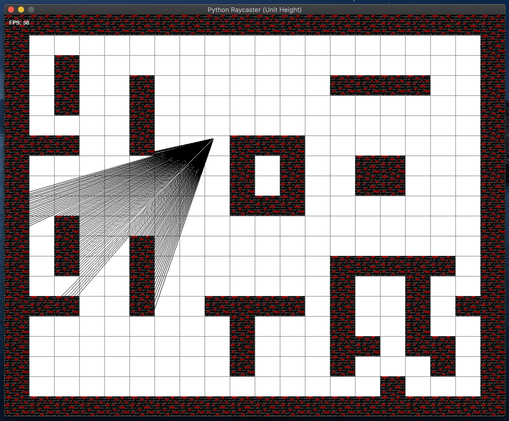

# Python Raycasting (Variable and Unit Height)

Two separate raycasting engines powered by Python and Pygame. 

The Variable Height engine is able to draw blocks of variable height, with the drawback of lower FPS. 

Unit Height engine is only able to draw blocks of all the same height, but with higher FPS and smoother graphics, more suitable for certain usage such as games.

## Features
- Variable height and Unit height engine selections.
- Walls can be drawn with solid colors, or user-selected textures.
- Full autonomy for user over map design, including block heights for individual map grids.
- POV navigation and ability to look around.
- Map mode to display user position, map design, and casted rays.

## Previews

### Variable Height Engine

### Unit Height Engine

### Map Mode

## Controls
- WASD - Movement Keys
- Arrow UP/DOWN - Adjust View
- M - Map Mode
- C - Toggle Crouch
- Y - Toggle Shadows On/Off
- T - Toggle Textures On/Off

## Some Customisable Settings
- Map design
- Texture design
- Initial player position
- Initial player direction
- Player FOV
- Player collision radius
- Player movement/ rotation speed

## Limitations
Variable height engine currently cannot correctly display walls of height under 0.5 units.

